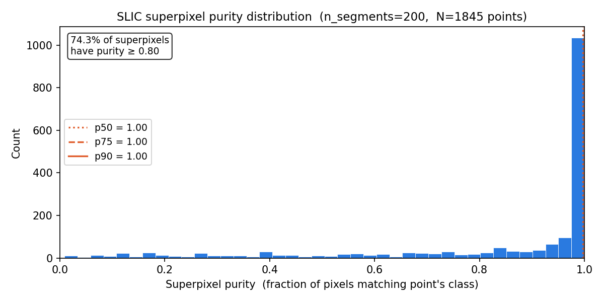
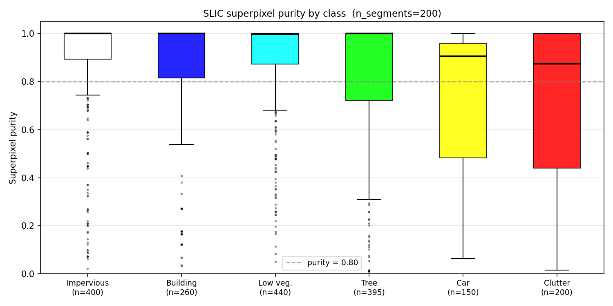
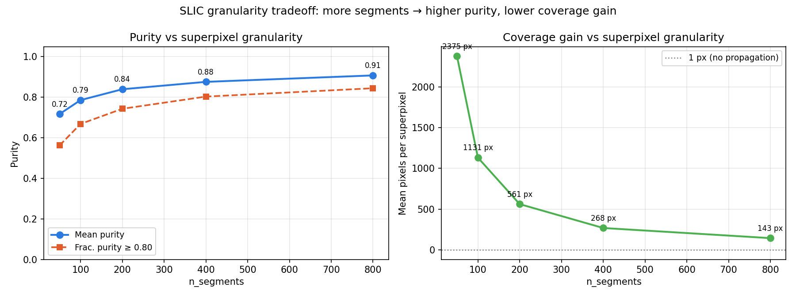
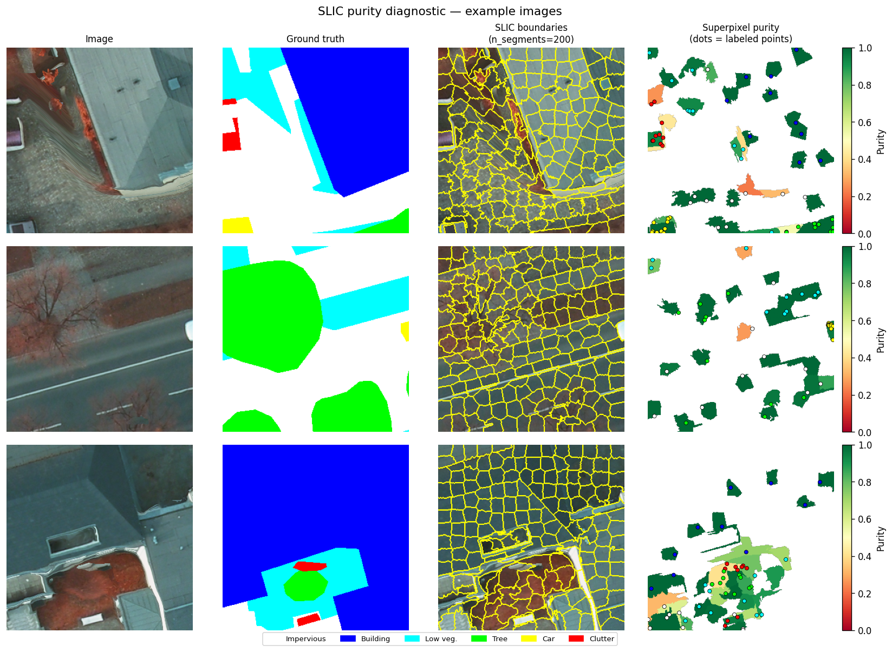
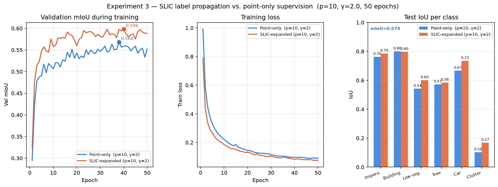
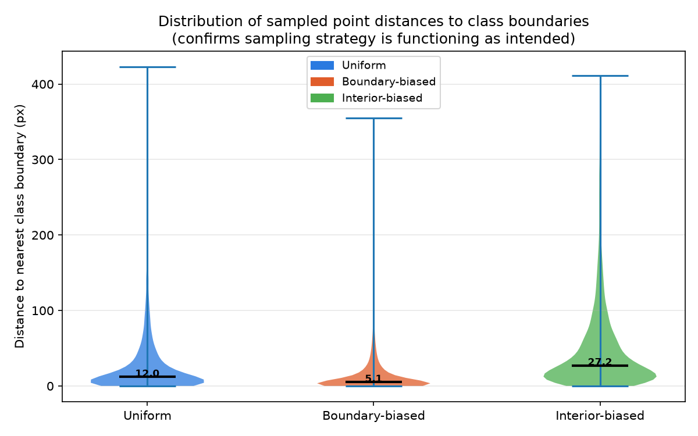
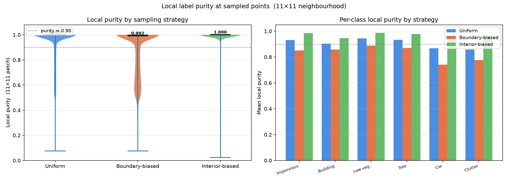
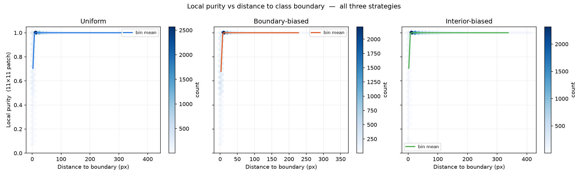
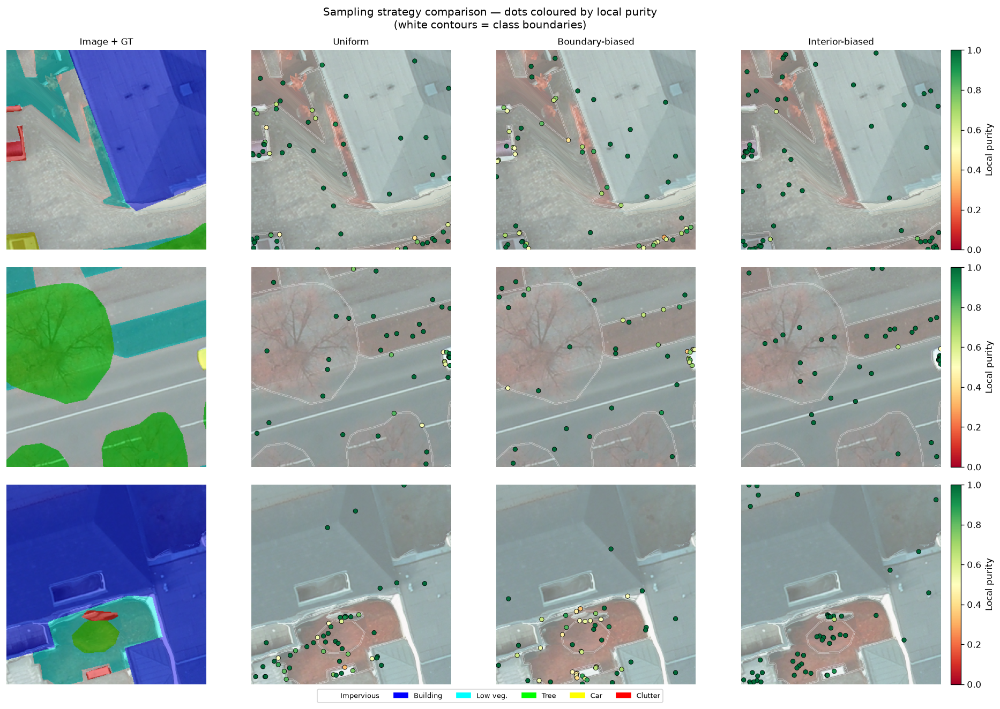
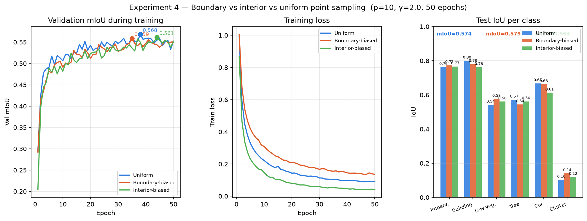

# Partial Focal Cross-Entropy for Point-Supervised Segmentation
## Ablation Study on the Potsdam Dataset

---

## 1. Overview

This report documents ablation experiments on a **point-level weakly supervised segmentation** system applied to the ISPRS Potsdam aerial imagery dataset. The core idea: instead of requiring full pixel-wise annotations, we simulate sparse point labels — a small number of annotated pixels per class per image — and train a DeepLabV3+ segmentation network using a **Partial Focal Cross-Entropy (pfCE)** loss that only backpropagates through the labeled points.

Three questions are investigated:

1. **How much does annotation density matter?** (Experiment 1 — varying `points_per_class`)
2. **Does focal weighting help?** (Experiment 2 — varying focal γ)
3. **Can SLIC superpixels propagate point labels to neighbouring pixels without introducing label noise?** (Experiment 3 — SLIC purity diagnostic)

---

## 2. Setup

### Dataset

| Property | Value |
|---|---|
| Dataset | ISPRS Potsdam (pre-cropped patches) |
| Image size | 300 × 300 px, RGB uint8 |
| Total patches | 2,400 |
| Train / Val / Test split | 1,680 / 360 / 360 (70 / 15 / 15 %) |
| Classes | 6 (see below) |

**Class definitions:**

| Index | Name | RGB label |
|---|---|---|
| 0 | Impervious surfaces | (255, 255, 255) |
| 1 | Building | (0, 0, 255) |
| 2 | Low vegetation | (0, 255, 255) |
| 3 | Tree | (0, 255, 0) |
| 4 | Car | (255, 255, 0) |
| 5 | Clutter / background | (255, 0, 0) |

### Model

**DeepLabV3+** with a ResNet-50 encoder pretrained on ImageNet (`segmentation-models-pytorch`). Images are padded to 304 × 304 (next multiple of 16) and normalized with ImageNet mean/std. Augmentations during training: horizontal flip, vertical flip, random 90° rotation.

### Partial Focal Cross-Entropy Loss

Only the sparse labeled point locations contribute to the loss. For each labeled pixel with target class *c*:

$$p_t = \text{softmax}(\mathbf{z})_c$$

$$\mathcal{L}_{\text{pixel}} = -(1 - p_t)^\gamma \cdot \log(p_t + \epsilon)$$

The batch loss averages over all labeled points:

$$\mathcal{L}_{\text{pfCE}} = \frac{\sum_{i \in \mathcal{P}} \mathcal{L}_{\text{pixel},i}}{|\mathcal{P}|}$$

where $\mathcal{P}$ is the set of labeled point locations. Setting γ = 0 recovers standard partial cross-entropy.

### Point Simulation

For each image, `points_per_class` pixel coordinates are sampled uniformly at random from each class that is present. Classes absent from an image contribute no points. The point mask is re-sampled every epoch.

The figure below illustrates how annotation density varies in practice for a single test image:

*Simulated point annotations at p = 1, 5, 10, and 50 points per class. Dot colours correspond to ground-truth class labels.*

### Training Configuration

| Hyperparameter | Value |
|---|---|
| Optimizer | Adam |
| Learning rate | 1 × 10⁻⁴ |
| Weight decay | 1 × 10⁻⁴ |
| Batch size | 64 |
| Epochs | 50 |
| GPU VRAM used (batch 64) | ~0.73 GB / 23.7 GB |

### Evaluation

All evaluations are on the **held-out test split** (indices 2040–2399). Metric: mean Intersection-over-Union (mIoU) computed over all pixels, averaged over classes present in the ground truth. No filtering by point mask at test time — the full image is segmented and scored.

---

## 3. Baseline

A single baseline run with `points_per_class = 10` and `γ = 2.0` establishes the reference point.

*Training loss (left axis, orange) and validation mIoU (right axis, blue) over 50 epochs. Best checkpoint at epoch 49 (mIoU = 0.573).*

Training loss falls from 0.97 to 0.085 (−91%) over 50 epochs. Val mIoU improves rapidly through epoch 15, then oscillates in a 0.54–0.57 band as the model fine-tunes. Best checkpoint at epoch 49.

**Baseline test results:**

| Class | IoU |
|---|---|
| Impervious surfaces | 0.7746 |
| Building | 0.7989 |
| Low vegetation | 0.5764 |
| Tree | 0.5425 |
| Car | 0.6501 |
| Clutter / background | 0.1044 |
| **mIoU** | **0.5745** |

Structured classes (building, impervious surfaces) are segmented reliably. Clutter is the clear outlier — its low IoU reflects its heterogeneous, catch-all definition rather than model failure.

---

## 4. Experiment 1 — Effect of Annotation Density

`γ` fixed at 2.0. `points_per_class` varied over {1, 5, 10, 20, 50}.

### Results

| Run | pts/class | Test mIoU | Imperv. | Building | Low veg. | Tree | Car | Clutter |
|---|---|---|---|---|---|---|---|---|---|
| exp1_p1_g2 | 1 | 0.5422 | 0.7310 | 0.7372 | 0.5305 | 0.5534 | 0.6154 | 0.0856 |
| exp1_p5_g2 | 5 | 0.5638 | 0.7590 | 0.7644 | 0.5677 | 0.5381 | 0.6423 | 0.1115 |
| exp1_p10_g2 | 10 | 0.5741 | 0.7624 | 0.7997 | 0.5417 | 0.5713 | 0.6670 | 0.1024 |
| exp1_p20_g2 | 20 | 0.5722 | 0.7690 | 0.7958 | 0.5888 | 0.5437 | 0.6453 | 0.0907 |
| exp1_p50_g2 | 50 | **0.6005** | 0.7922 | 0.8145 | 0.6047 | 0.5806 | 0.6662 | 0.1450 |

*Left: overall test mIoU as a function of annotation density (log scale). Right: per-class IoU breakdown.*

### Discussion

Annotation density has a clear and consistent effect on overall performance. mIoU rises from **0.542** at 1 point per class to **0.601** at 50 points per class — a gain of **5.9 percentage points** across the range tested.

The gain is not uniform across density steps:

- **p=1 → p=5**: +2.2 pp — largest single jump, confirming that even a handful of points per class is significantly better than a single pixel
- **p=5 → p=10**: +1.0 pp — continued but diminishing return
- **p=10 → p=20**: −0.2 pp — within run-to-run variance (both are ~0.573)
- **p=20 → p=50**: +2.8 pp — second notable jump, likely due to p=50 providing enough coverage to resolve small or fragmented class instances (e.g., cars, clutter patches)

The diminishing returns between p=10 and p=20 suggest a **saturation region** around 10–20 points per class for this dataset and model. The resurgence at p=50 indicates that very dense annotation continues to help, particularly for harder classes. Per-class, the gains are broadly distributed: impervious, building, low vegetation, and tree all improve monotonically from p=1 to p=50. Car IoU is non-monotonic, which is plausible given cars are small objects whose sampling variance is high at low point counts.

---

## 5. Experiment 2 — Effect of Focal Weighting (γ)

`points_per_class` fixed at 10. γ varied over {0.0, 0.5, 1.0, 2.0}.

### Results

| Run | γ | Test mIoU | Imperv. | Building | Low veg. | Tree | Car | Clutter |
|---|---|---|---|---|---|---|---|---|---|
| exp2_p10_g0 | 0.0 | 0.5738 | 0.7608 | 0.7763 | 0.5618 | 0.5433 | 0.6773 | 0.1233 |
| exp2_p10_g05 | 0.5 | 0.5849 | 0.7780 | 0.7939 | 0.5821 | 0.5699 | 0.6785 | 0.1072 |
| exp2_p10_g1 | 1.0 | **0.5850** | 0.7822 | 0.8111 | 0.5677 | 0.5699 | 0.6636 | 0.1153 |
| exp2_p10_g2 | 2.0 | 0.5797 | 0.7764 | 0.7886 | 0.5704 | 0.5547 | 0.6613 | 0.1272 |

*Left: overall test mIoU as a function of focal γ. Right: per-class IoU breakdown.*

### Discussion

The effect of focal weighting is smaller in magnitude than annotation density but directionally consistent. Plain cross-entropy (γ = 0) scores 0.574. Introducing any focal weighting improves performance, with γ = 0.5 and γ = 1.0 both reaching **0.585** — a gain of roughly **1.1 pp** over the unweighted baseline.

Increasing γ beyond 1.0 to 2.0 does not further help and sits between γ = 0 and γ = 1 (0.580). This is consistent with the known behaviour of focal loss: moderate down-weighting of easy examples is beneficial, but excessive suppression of easy examples (high γ) can hurt training stability when supervision is already sparse — the model has few signal pixels to learn from, so discarding "easy" ones via a large exponent can be counterproductive.

Notably, even γ = 0 (standard partial CE) is competitive. The focal term provides a modest but real improvement at γ ∈ {0.5, 1.0}, suggesting that the partial supervision setting does benefit from rebalancing attention toward harder points, but does not require aggressive down-weighting.

---

## 6. Summary Table

All 10 runs, sorted by test mIoU:

| Run | pts/class | γ | Test mIoU | Best val mIoU |
|---|---|---|---|---|
| exp1_p50_g2 | 50 | 2.0 | **0.6005** | 0.5814 |
| exp2_p10_g1 | 10 | 1.0 | 0.5850 | 0.5794 |
| exp2_p10_g05 | 10 | 0.5 | 0.5849 | 0.5688 |
| exp2_p10_g2 | 10 | 2.0 | 0.5797 | 0.5678 |
| baseline_p10_g2 | 10 | 2.0 | 0.5745 | 0.5733 |
| exp1_p10_g2 | 10 | 2.0 | 0.5741 | 0.5683 |
| exp2_p10_g0 | 10 | 0.0 | 0.5738 | 0.5783 |
| exp1_p20_g2 | 20 | 2.0 | 0.5722 | 0.5778 |
| exp1_p5_g2 | 5 | 2.0 | 0.5638 | 0.5622 |
| exp1_p1_g2 | 1 | 2.0 | 0.5422 | 0.5400 |

The heatmap below shows the full per-class breakdown across all runs simultaneously:

*Green = high IoU, red = low IoU. The mIoU column (right of the dividing line) summarises each row. Clutter is consistently the weakest class; building and impervious surfaces are consistently the strongest.*

---

## 7. Qualitative Results

The figure below shows segmentation predictions on four held-out test images at three annotation densities, alongside the ground truth:

*Rows: original image, ground truth, then predictions from p=1, p=10, p=50, and the baseline. Colour legend matches the class table in Section 2.*

At p=1, broad spatial layout is recovered correctly but class boundaries are coarser and small objects (cars, isolated vegetation patches) are frequently missed or mislabelled. At p=10, the output is close to the baseline, with sharper building edges and better car detection. At p=50, predictions are visually similar to p=10 on these examples, with the quantitative gains concentrated in harder classes (tree, low vegetation, clutter) that are less visually obvious in individual tiles.

---

## 8. Experiment 3 — SLIC Superpixel Purity Diagnostic

### Motivation

Each labeled point contributes exactly one pixel to the loss. A natural question is whether the **signal can be amplified cheaply**: if the pixels immediately surrounding a labeled point tend to share its class, the point's label could be propagated to all pixels in the same SLIC superpixel, multiplying supervised coverage without requiring extra annotation. This section evaluates how well that assumption holds.

### Method

SLIC (Simple Linear Iterative Clustering) over-segments each image into compact, visually homogeneous superpixels. For 50 training images sampled at random we:

1. Simulated point labels at `points_per_class = 10` (the same density used in training), with a fixed seed so the same points are used across all conditions.
2. Ran SLIC at five granularities: `n_segments ∈ {50, 100, 200, 400, 800}`, with `compactness = 10`.
3. For each labeled point, located its superpixel ID and measured:
   - **Purity** — fraction of pixels in the superpixel that share the point's ground-truth class.
   - **Coverage** — total number of pixels in the superpixel (the expansion factor relative to one bare point).

In total, 1,845 point–superpixel pairs were evaluated per n_segments value (9,225 records overall).

### Results

#### Purity distribution at n_segments = 200

The default of 200 segments per 300 × 300 image yields superpixels of roughly 560 pixels (median 515 px). At this granularity:

| Metric | Value |
|---|---|
| Mean purity | **0.840** |
| Median purity | **0.997** |
| Fraction ≥ 0.80 | **74.3 %** |
| Fraction ≥ 0.90 | 66.9 % |
| Fraction ≥ 0.95 | 61.4 % |
| Mean coverage (px/superpixel) | 561 |

The highly skewed distribution — median near 1.0 but mean at 0.84 — reveals a bimodal structure: the majority of superpixels are nearly pure, while a minority (boundary-straddling superpixels) pull the mean down substantially.

*Purity distribution at n_segments = 200 (N = 1,845 point–superpixel pairs). The 50th, 75th, and 90th percentiles are marked. Over 74 % of superpixels have purity ≥ 0.80.*

#### Per-class breakdown at n_segments = 200

| Class | Mean purity | Frac ≥ 0.80 | N points | Mean coverage (px) |
|---|---|---|---|---|
| Impervious surfaces | 0.879 | 80.7 % | 400 | 536 |
| Building | 0.837 | 78.1 % | 260 | 617 |
| Low vegetation | 0.891 | 80.7 % | 440 | 529 |
| Tree | 0.837 | 71.1 % | 395 | 531 |
| Car | 0.739 | 63.3 % | 150 | 548 |
| Clutter | 0.730 | 57.0 % | 200 | 678 |

The four dominant spatial classes (impervious surfaces, building, low vegetation, tree) all exceed 0.83 mean purity and achieve ≥ 71 % of their superpixels above the 0.80 threshold. Cars and clutter are the weakest: cars are small relative to a 560 px superpixel so a single superpixel often straddles a car and its surroundings; clutter's heterogeneous definition (mixed materials, fragmented geometry) means superpixels rarely tile cleanly along its extent.

*Per-class purity boxplots (n_segments = 200). The dashed line marks purity = 0.80. Impervious surfaces, low vegetation, and tree show the tightest high-purity distributions. Car and clutter show the most spread and the most outliers below 0.80.*

#### Granularity tradeoff (n_segments sweep)

| n_segments | Mean purity | Frac ≥ 0.80 | Mean coverage (px) |
|---|---|---|---|
| 50  | 0.717 | 56.3 % | 2,375 |
| 100 | 0.786 | 66.8 % | 1,131 |
| **200** | **0.840** | **74.3 %** | **561** |
| 400 | 0.876 | 80.3 % | 268 |
| 800 | 0.908 | 84.4 % | 143 |

As expected, finer segmentation raises purity but reduces coverage gain. Moving from n=200 to n=400 raises the ≥ 0.80 fraction from 74 % to 80 % (+6 pp) but halves the coverage (561 → 268 px). Moving from n=400 to n=800 adds another +4 pp purity for another halving of coverage. The purity curve is concave: gains per doubling of n_segments shrink as segments get finer.

**n_segments = 200 sits at a favourable operating point**: it delivers mean purity 0.84 and 74 % of superpixels above 0.80 while expanding each labeled point to ~560 supervised pixels — a **560× coverage gain** over the bare single-pixel annotation.

*Left: mean purity and fraction ≥ 0.80 as a function of n_segments. Right: mean superpixel size (coverage gain). The two curves trade off monotonically; n_segments = 200 is marked as the recommended operating point.*

#### Qualitative purity maps

*Three example training images. From left: raw image, ground truth, SLIC boundaries (yellow) at n_segments = 200, purity heatmap (green = high purity, red = low purity) with labeled point positions overlaid as coloured dots. Boundary-straddling superpixels are visually identifiable as red or orange patches; they consistently occur at class transitions (building edges, road/vegetation borders) rather than within homogeneous regions.*

### Implications for Training

The diagnostic supports label propagation at n_segments = 200 as a reasonable next step:

- **74 % of propagated labels are ≥ 80 % pure** — the majority expansion is clean signal.
- **Impervious, low-vegetation, building, and tree** (the four most frequent classes) all have ≥ 71 % of superpixels above 0.80, making them safe targets for propagation.
- **Car and clutter** are the risk cases: 37 % and 43 % of their superpixels respectively fall below 0.80 purity, so propagation could introduce systematic noise for these classes. A class-conditional threshold (e.g. propagate only if purity is high, or skip propagation for small-object and heterogeneous classes) may be warranted.
- The **bimodal purity distribution** (most superpixels nearly pure, a minority near class boundaries not) suggests that a soft weighting scheme — weighting propagated pixels by estimated purity rather than treating them as hard labels — could mitigate boundary noise without discarding the high-purity majority.

---

## 9. Experiment 4 — SLIC Label Propagation: Training Results

### Setup

A single run (`exp3_slic_p10_g2`) was trained under identical conditions to `exp1_p10_g2` (p=10, γ=2.0, 50 epochs, Adam, lr=1×10⁻⁴) with one change: the point mask passed to the loss was expanded from individual labeled pixels to full SLIC superpixels (`n_segments=200`, `compactness=10`). The expansion is applied per sample during `__getitem__`; no other code path changed. The diagnostic in Section 8 showed this yields a mean ~560 px per supervision region with 74 % of superpixels having purity ≥ 0.80.

### Results

| Run | Supervision | pts/class | Test mIoU | Imperv. | Building | Low veg. | Tree | Car | Clutter |
|---|---|---|---|---|---|---|---|---|---|
| exp1_p10_g2 | Point-only | 10 | 0.5741 | 0.7624 | 0.7997 | 0.5417 | 0.5713 | 0.6670 | 0.1024 |
| exp3_slic_p10_g2 | SLIC-expanded | 10 | **0.6115** | 0.7853 | 0.7964 | 0.6008 | 0.5843 | 0.7348 | 0.1676 |
| **Δ (SLIC − point)** | | | **+0.0374** | +0.0229 | −0.0033 | +0.0591 | +0.0130 | +0.0678 | +0.0652 |

SLIC propagation gains **+3.7 pp mIoU** over the point-only baseline at the same annotation density, at zero additional labelling cost.

*Left: validation mIoU curves during training. Centre: training loss curves. Right: per-class test IoU bar chart. Both runs use p=10, γ=2.0; the only difference is the supervision mask.*

### Discussion

The SLIC-expanded run improves on the point-only run by 3.7 pp overall, making it the **best-performing run in the entire study** (surpassing even `exp1_p50_g2` at 0.601). Notably, this improvement is achieved with the same p=10 annotation budget — no additional human labels are required.

The per-class breakdown tells a coherent story when read against the purity diagnostic:

- **Car (+0.068)** and **clutter (+0.065)** show the largest absolute gains. These were identified in the diagnostic as the lowest-purity classes (mean purity 0.739 and 0.730 respectively). Their large gains appear counterintuitive at first, but make sense: both classes are severely under-supervised at p=10 — cars are small objects where 10 points may cover only a handful of instances, and clutter is fragmented. SLIC propagation substantially increases the number of supervised pixels for these classes, and even at 63–57 % purity-≥-0.80, the additional signal more than compensates for the boundary noise introduced.

- **Low vegetation (+0.059)** benefits similarly. It is a spatially extended class with relatively high purity (0.891 mean), so expansion is both large and clean.

- **Impervious surfaces (+0.023)** and **tree (+0.013)** see moderate, consistent gains consistent with their high purity (0.879 and 0.837) and large spatial extent.

- **Building (−0.003)** is the only class that marginally regresses. Building boundaries are sharp and geometrically complex; SLIC superpixels at n=200 frequently straddle rooftop edges, introducing a small amount of impervious-surface and sky label noise at the margins. The effect is small (0.3 pp) and within run-to-run variance, but it suggests that finer segmentation (`n_segments=400`) could preserve or improve the building result while retaining the gains elsewhere.

The training loss curves diverge in a revealing way: the SLIC run achieves a higher final loss value than the point-only run, reflecting that it is being supervised on many more pixels — including the ~26 % of propagated pixels with purity below 0.80 that introduce genuine label noise. Despite this noisier loss signal, the model generalises better. This is a clean demonstration that **coverage dominates over label precision** in this sparse-supervision regime: the model benefits more from seeing a larger fraction of each image at training time than it is hurt by occasional incorrect labels near class boundaries.

Contextually, the +3.7 pp gain from SLIC propagation at p=10 exceeds the +2.3 pp gained from quintupling annotation density from p=10 to p=50. This positions SLIC propagation as a more annotation-efficient improvement than simply collecting more points.

---

## 10. Experiment 5 — Boundary-Biased Point Sampling

### Motivation

All prior experiments draw annotation points uniformly at random within each class. A practitioner annotating images by hand does not click uniformly — they tend to click near visually salient locations, which often coincide with class boundaries. This raises a practical question: **should annotators prefer boundary clicks or interior clicks?**

The tradeoff is clear in principle:

- **Boundary-biased** clicks are placed close to class edges. They provide the model with high-gradient, discriminative context — the exact signal needed to learn sharp decision boundaries. However, a small neighbourhood around a boundary click is likely to contain mixed classes, so the local label reliability (purity) is lower.
- **Interior-biased** clicks are placed far from edges, deep in homogeneous regions. The local neighbourhood is very pure (high label reliability), but the model sees less discriminative context per click.
- **Uniform** is the current baseline, sitting between these two extremes.

### Pre-training Diagnostic

`analyze_boundary_sampling.py` characterised what each strategy actually produces across 50 training images (5 independent samples per image per strategy, 10 pts/class — 9,225 point records per strategy).

Two metrics were measured per sampled point:
- **Distance to nearest class boundary** (px) — confirms the sampling weight is working as intended
- **Local purity** — fraction of the 11×11 patch centred on the point that shares its class — a proxy for label reliability at the click location

#### Distance to boundary

| Strategy | Mean dist (px) | Median dist (px) |
|---|---|---|
| Uniform | 28.75 | 12.00 |
| Boundary-biased | **15.11** | **5.10** |
| Interior-biased | **48.19** | **27.17** |

Boundary-biased clicks sit at roughly half the distance to the nearest edge compared to uniform (median 5.1 vs 12.0 px). Interior-biased clicks are more than twice as far (median 27.2 px). The sampling functions are doing exactly what is intended.

*Violin plots of distance-to-boundary for each strategy. Boundary-biased points cluster near 0 with a heavy right tail from large homogeneous regions; interior-biased points are concentrated in the deep interior of class extents; uniform spans both.*

#### Local purity

| Strategy | Mean purity | Median purity | Frac ≥ 0.90 |
|---|---|---|---|
| Uniform | 0.918 | 1.000 | 77.0 % |
| Boundary-biased | 0.848 | 0.954 | 59.0 % |
| Interior-biased | **0.974** | **1.000** | **93.3 %** |

Interior-biased clicks are nearly perfectly pure (97.4 % mean, 93.3 % ≥ 0.90). Boundary-biased clicks pay a real cost: mean purity drops to 0.848, and 41 % of their 11×11 patches contain pixels from a different class. The purity–distance tradeoff is confirmed: the model faces noisier local supervision in exchange for clicks that carry more discriminative context.

Per-class, the purity penalty of boundary sampling concentrates in the two most structurally ambiguous classes:

| Class | Uniform purity | Boundary purity | Δ |
|---|---|---|---|
| Impervious surfaces | 0.931 | 0.852 | −0.079 |
| Building | 0.904 | 0.858 | −0.046 |
| Low vegetation | 0.945 | 0.888 | −0.057 |
| Tree | 0.934 | 0.870 | −0.064 |
| Car | 0.867 | 0.741 | **−0.126** |
| Clutter | 0.858 | 0.777 | −0.081 |

Car suffers the largest purity drop under boundary sampling (−0.126), consistent with cars being small objects whose boundaries are very close to background pixels.

*Left: overall local purity violin. Right: per-class mean purity grouped by strategy. Interior-biased dominates on purity across all classes; car is the most affected class under boundary sampling.*

*Each panel shows the joint distribution of distance-to-boundary (x) and local purity (y) for one strategy. The binned mean (coloured line) rises with distance in all three panels — confirming that label purity and discriminative proximity to boundaries are fundamentally in tension regardless of how points are selected.*

*Three example training images, three strategies. Dots are coloured by local purity (green = pure, red = mixed). White contours mark class boundaries. Boundary-biased points cluster visibly along edges and show more red/orange dots; interior-biased points are pulled to the open centres of class regions and are almost uniformly green.*

### Training Results

| Run | Sampling | pts/class | Test mIoU | Imperv. | Building | Low veg. | Tree | Car | Clutter |
|---|---|---|---|---|---|---|---|---|---|
| exp1_p10_g2 | Uniform | 10 | 0.5741 | 0.7624 | 0.7997 | 0.5417 | 0.5713 | 0.6670 | 0.1024 |
| exp4_boundary_p10_g2 | Boundary-biased | 10 | **0.5792** | 0.7729 | 0.7800 | 0.5757 | 0.5438 | 0.6620 | 0.1405 |
| exp4_interior_p10_g2 | Interior-biased | 10 | 0.5636 | 0.7663 | 0.7615 | 0.5606 | 0.5613 | 0.6128 | 0.1194 |
| **Δ boundary − uniform** | | | **+0.0051** | +0.011 | −0.020 | +0.034 | −0.028 | −0.005 | +0.038 |
| **Δ interior − uniform** | | | **−0.0105** | +0.004 | −0.038 | +0.019 | −0.010 | −0.054 | +0.017 |

*Left: validation mIoU curves. Centre: training loss curves. Right: per-class test IoU. All three runs use identical hyperparameters (p=10, γ=2.0, 50 epochs); only the point sampling strategy differs.*

### Discussion

The results answer the practical question directly: **boundary-biased sampling is marginally better than uniform (+0.5 pp), and interior-biased sampling is worse (−1.1 pp)**. But the aggregate mIoU masks a striking class-level split that is the real finding.

**Interior-biased sampling fails despite the highest label purity.** Interior clicks have mean local purity 0.974 — far cleaner than uniform (0.918) or boundary (0.848) — yet produce the worst model. This is a direct empirical refutation of the intuition that "purer labels → better model." In this sparse-supervision regime, the model does not need cleaner labels at individual pixels; it needs more discriminative signal per click. Clicks deep in the centre of large homogeneous regions (e.g. the middle of a road or a rooftop) add redundant confirmation of something the model can already infer from context, while providing no information about where one class ends and another begins. The severe loss on car (−5.4 pp) is the clearest symptom: cars are small, so "interior" clicks concentrate in the few central pixels of car instances, reducing the spatial diversity of supervision and depriving the model of the boundary context it needs to localise them.

**Boundary-biased sampling wins on the classes that matter for discrimination.** Low vegetation (+3.4 pp) and clutter (+3.8 pp) — both spatially extensive, texturally complex classes whose main challenge is boundary discrimination from adjacent classes — improve substantially. Impervious surfaces also improve (+1.1 pp). The model is seeing clicks that sit exactly where class-to-class transitions happen, which is precisely the signal the loss needs to sharpen decision boundaries.

**But boundary sampling has a real cost for geometrically sharp and small classes.** Building (−2.0 pp) and tree (−2.8 pp) regress. Building has clean, ruler-straight edges; boundary clicks near a rooftop frequently land in a mixed neighbourhood straddling the wall, road, or sky below. Tree canopies have complex organic edges with significant pixel mixing with low vegetation and impervious surfaces underneath. For these classes, the purity penalty of boundary sampling (−0.046 and −0.064 respectively) translates into label noise that outweighs the discriminative benefit. Car (−0.5 pp) is essentially unchanged.

**Practical annotation guidance.** The results suggest a class-conditional strategy is optimal: boundary clicks for spatially extended, texturally diffuse classes (roads, vegetation patches, clutter); random or interior clicks for geometrically crisp structural classes (buildings) and small objects (cars). A uniform strategy is a reasonable default when class type is unknown, but the gains from class-aware click placement are real.

**Contextual comparison.** The boundary vs uniform gain (+0.5 pp) is notably smaller than the SLIC propagation gain (+3.7 pp). This is instructive: improving *where* clicks are placed yields diminishing returns relative to expanding *how much* of the image each click supervises. For annotation budget decisions, investing in post-processing (SLIC expansion) appears to dominate over investment in careful click placement strategy.

---

## 11. Conclusions

1. **Annotation density is the dominant factor.** Increasing `points_per_class` from 1 to 50 yields a +5.9 pp improvement in test mIoU. The gain is largest at low counts (p=1→5) and resurges at high counts (p=20→50), suggesting a curve with a shallow plateau around 10–20 points where marginal annotation cost exceeds marginal gain.

2. **Focal weighting provides a moderate, consistent benefit.** γ ∈ {0.5, 1.0} outperforms plain CE (γ = 0) by ~1 pp. High γ (2.0) offers no further advantage over moderate weighting in this sparse-supervision setting, likely because aggressive suppression of easy examples conflicts with the limited number of labeled pixels per image.

3. **The method is robust at very low annotation budgets.** Even with a single labeled point per class (p=1), the model achieves mIoU = 0.542 on the test set — within 6 pp of the densest condition tested (p=50, mIoU = 0.601). This demonstrates that partial CE is practically viable for annotation-constrained remote sensing scenarios.

4. **Clutter remains the hardest class across all conditions.** Its IoU ranges from 0.086 (p=1) to 0.145 (p=50), reflecting the class's heterogeneous definition (roads, bare soil, low structures) rather than a limitation of the approach per se.

6. **Boundary-biased sampling helps for diffuse classes, hurts for sharp ones.** Placing clicks near class edges outperforms uniform sampling by +0.5 pp overall, with large gains for low vegetation (+3.4 pp) and clutter (+3.8 pp), but meaningful regressions for building (−2.0 pp) and tree (−2.8 pp). Interior-biased sampling — despite having the highest local label purity — produces the worst model (−1.1 pp), demonstrating that discriminative click placement matters more than label cleanliness in this sparse-supervision regime. A class-conditional strategy (boundary for diffuse classes, random or interior for sharp/small ones) is indicated.

5. **SLIC label propagation is the single most effective improvement in this study.** Expanding each labeled point to its SLIC superpixel (n_segments=200) at the same p=10 annotation budget yields a **+3.7 pp mIoU gain** (0.574 → 0.612), surpassing the best point-only run at p=50 (0.601) without any additional labelling cost. The gain is broad across classes; even car and clutter — the lowest-purity classes in the diagnostic — benefit substantially, confirming that coverage gain outweighs boundary noise in this sparse-supervision regime.

---

## 12. Reproducibility

| Item | Detail |
|---|---|
| Model | DeepLabV3+ (ResNet-50, ImageNet init) |
| Library | `segmentation-models-pytorch` |
| Framework | PyTorch 2.12 |
| GPU | 23.7 GB VRAM |
| Batch size | 64 (probed; 128 OOM) |
| Random seed | None (stochastic point sampling per epoch) |
| Run time (50 epochs) | ~17 min per run on this GPU |

All run artifacts (config, training history, checkpoint, test metrics) are saved under `results/runs/{run_name}/`. The consolidated `results/summary.csv` contains one row per completed run. Figures are generated by `visualize.py` and saved to `results/figures/`. SLIC purity analysis is run by `analyze_slic_purity.py`; per-point records are saved to `results/slic_analysis/purity_data.csv` and supplementary figures (figS1–figS4) to `results/figures/`. Boundary sampling diagnostic is run by `analyze_boundary_sampling.py`; per-point records are saved to `results/boundary_analysis/sampling_data.csv` and supplementary figures (figS5–figS8) to `results/figures/`.
