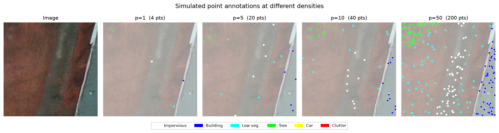
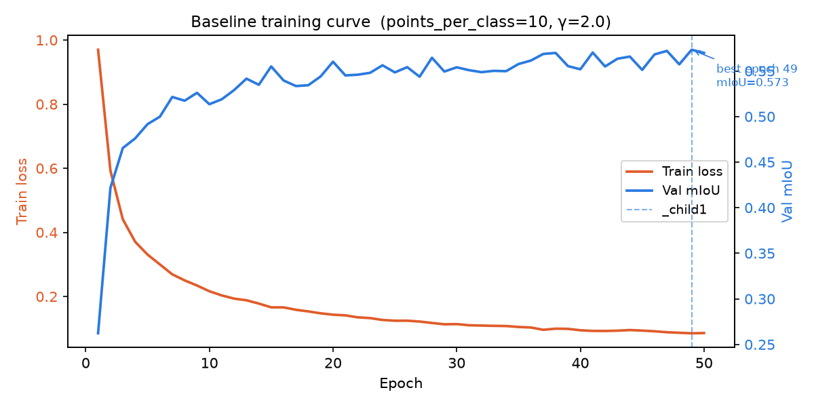
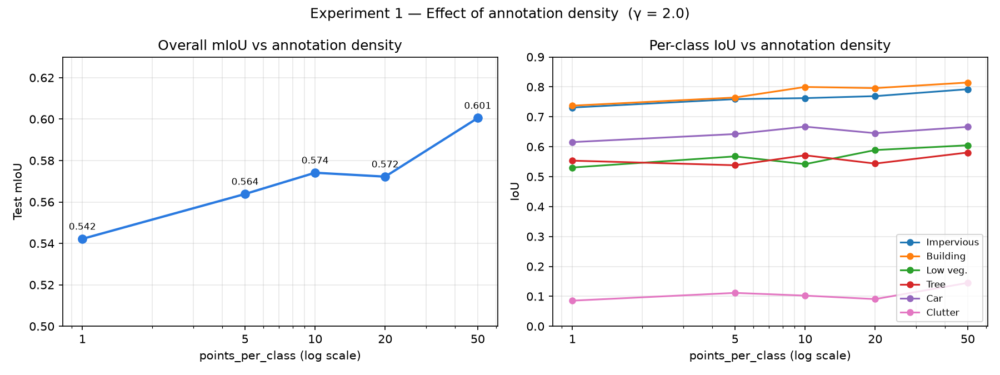
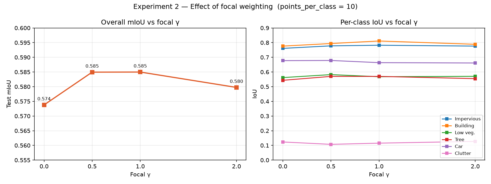
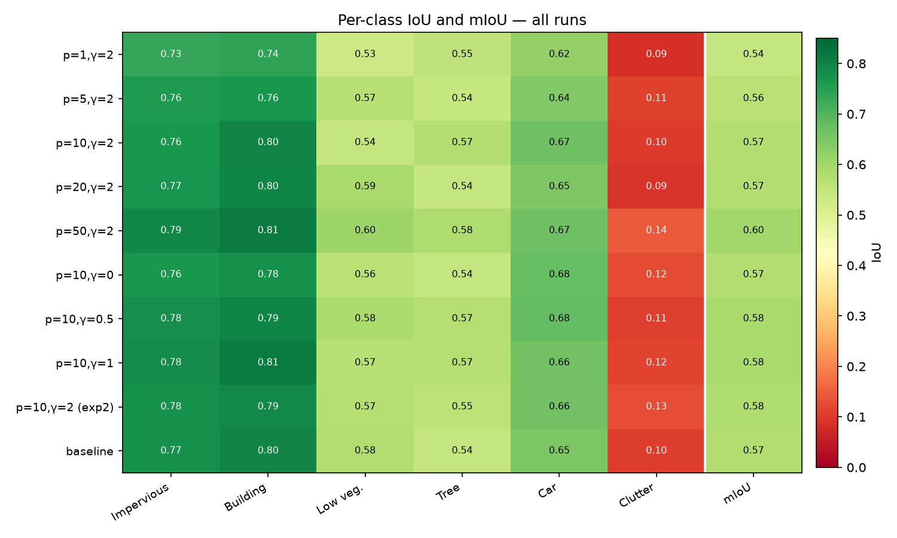
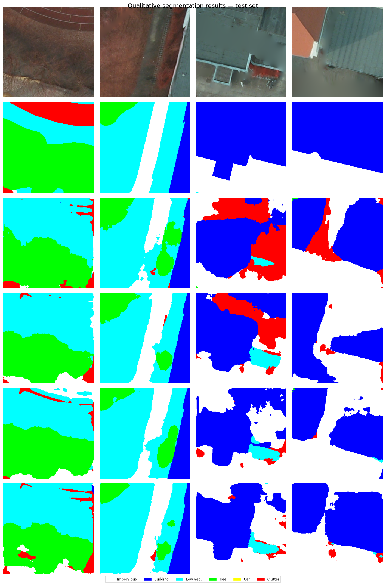

# Partial Focal Cross-Entropy for Point-Supervised Segmentation
## Ablation Study on the Potsdam Dataset

---

## 1. Overview

This report documents ablation experiments on a **point-level weakly supervised segmentation** system applied to the ISPRS Potsdam aerial imagery dataset. The core idea: instead of requiring full pixel-wise annotations, we simulate sparse point labels — a small number of annotated pixels per class per image — and train a DeepLabV3+ segmentation network using a **Partial Focal Cross-Entropy (pfCE)** loss that only backpropagates through the labeled points.

Two questions are investigated:

1. **How much does annotation density matter?** (Experiment 1 — varying `points_per_class`)
2. **Does focal weighting help?** (Experiment 2 — varying focal γ)

---

## 2. Setup

### Dataset

| Property | Value |
|---|---|
| Dataset | ISPRS Potsdam (pre-cropped patches) |
| Image size | 300 × 300 px, RGB uint8 |
| Total patches | 2,400 |
| Train / Val / Test split | 1,680 / 360 / 360 (70 / 15 / 15 %) |
| Classes | 6 (see below) |

**Class definitions:**

| Index | Name | RGB label |
|---|---|---|
| 0 | Impervious surfaces | (255, 255, 255) |
| 1 | Building | (0, 0, 255) |
| 2 | Low vegetation | (0, 255, 255) |
| 3 | Tree | (0, 255, 0) |
| 4 | Car | (255, 255, 0) |
| 5 | Clutter / background | (255, 0, 0) |

### Model

**DeepLabV3+** with a ResNet-50 encoder pretrained on ImageNet (`segmentation-models-pytorch`). Images are padded to 304 × 304 (next multiple of 16) and normalized with ImageNet mean/std. Augmentations during training: horizontal flip, vertical flip, random 90° rotation.

### Partial Focal Cross-Entropy Loss

Only the sparse labeled point locations contribute to the loss. For each labeled pixel with target class *c*:

$$p_t = \text{softmax}(\mathbf{z})_c$$

$$\mathcal{L}_{\text{pixel}} = -(1 - p_t)^\gamma \cdot \log(p_t + \epsilon)$$

The batch loss averages over all labeled points:

$$\mathcal{L}_{\text{pfCE}} = \frac{\sum_{i \in \mathcal{P}} \mathcal{L}_{\text{pixel},i}}{|\mathcal{P}|}$$

where $\mathcal{P}$ is the set of labeled point locations. Setting γ = 0 recovers standard partial cross-entropy.

### Point Simulation

For each image, `points_per_class` pixel coordinates are sampled uniformly at random from each class that is present. Classes absent from an image contribute no points. The point mask is re-sampled every epoch.

The figure below illustrates how annotation density varies in practice for a single test image:

*Simulated point annotations at p = 1, 5, 10, and 50 points per class. Dot colours correspond to ground-truth class labels.*

### Training Configuration

| Hyperparameter | Value |
|---|---|
| Optimizer | Adam |
| Learning rate | 1 × 10⁻⁴ |
| Weight decay | 1 × 10⁻⁴ |
| Batch size | 64 |
| Epochs | 50 |
| GPU VRAM used (batch 64) | ~0.73 GB / 23.7 GB |

### Evaluation

All evaluations are on the **held-out test split** (indices 2040–2399). Metric: mean Intersection-over-Union (mIoU) computed over all pixels, averaged over classes present in the ground truth. No filtering by point mask at test time — the full image is segmented and scored.

---

## 3. Baseline

A single baseline run with `points_per_class = 10` and `γ = 2.0` establishes the reference point.

*Training loss (left axis, orange) and validation mIoU (right axis, blue) over 50 epochs. Best checkpoint at epoch 49 (mIoU = 0.573).*

Training loss falls from 0.97 to 0.085 (−91%) over 50 epochs. Val mIoU improves rapidly through epoch 15, then oscillates in a 0.54–0.57 band as the model fine-tunes. Best checkpoint at epoch 49.

**Baseline test results:**

| Class | IoU |
|---|---|
| Impervious surfaces | 0.7746 |
| Building | 0.7989 |
| Low vegetation | 0.5764 |
| Tree | 0.5425 |
| Car | 0.6501 |
| Clutter / background | 0.1044 |
| **mIoU** | **0.5745** |

Structured classes (building, impervious surfaces) are segmented reliably. Clutter is the clear outlier — its low IoU reflects its heterogeneous, catch-all definition rather than model failure.

---

## 4. Experiment 1 — Effect of Annotation Density

`γ` fixed at 2.0. `points_per_class` varied over {1, 5, 10, 20, 50}.

### Results

| Run | pts/class | Test mIoU | Imperv. | Building | Low veg. | Tree | Car | Clutter |
|---|---|---|---|---|---|---|---|---|---|
| exp1_p1_g2 | 1 | 0.5422 | 0.7310 | 0.7372 | 0.5305 | 0.5534 | 0.6154 | 0.0856 |
| exp1_p5_g2 | 5 | 0.5638 | 0.7590 | 0.7644 | 0.5677 | 0.5381 | 0.6423 | 0.1115 |
| exp1_p10_g2 | 10 | 0.5741 | 0.7624 | 0.7997 | 0.5417 | 0.5713 | 0.6670 | 0.1024 |
| exp1_p20_g2 | 20 | 0.5722 | 0.7690 | 0.7958 | 0.5888 | 0.5437 | 0.6453 | 0.0907 |
| exp1_p50_g2 | 50 | **0.6005** | 0.7922 | 0.8145 | 0.6047 | 0.5806 | 0.6662 | 0.1450 |

*Left: overall test mIoU as a function of annotation density (log scale). Right: per-class IoU breakdown.*

### Discussion

Annotation density has a clear and consistent effect on overall performance. mIoU rises from **0.542** at 1 point per class to **0.601** at 50 points per class — a gain of **5.9 percentage points** across the range tested.

The gain is not uniform across density steps:

- **p=1 → p=5**: +2.2 pp — largest single jump, confirming that even a handful of points per class is significantly better than a single pixel
- **p=5 → p=10**: +1.0 pp — continued but diminishing return
- **p=10 → p=20**: −0.2 pp — within run-to-run variance (both are ~0.573)
- **p=20 → p=50**: +2.8 pp — second notable jump, likely due to p=50 providing enough coverage to resolve small or fragmented class instances (e.g., cars, clutter patches)

The diminishing returns between p=10 and p=20 suggest a **saturation region** around 10–20 points per class for this dataset and model. The resurgence at p=50 indicates that very dense annotation continues to help, particularly for harder classes. Per-class, the gains are broadly distributed: impervious, building, low vegetation, and tree all improve monotonically from p=1 to p=50. Car IoU is non-monotonic, which is plausible given cars are small objects whose sampling variance is high at low point counts.

---

## 5. Experiment 2 — Effect of Focal Weighting (γ)

`points_per_class` fixed at 10. γ varied over {0.0, 0.5, 1.0, 2.0}.

### Results

| Run | γ | Test mIoU | Imperv. | Building | Low veg. | Tree | Car | Clutter |
|---|---|---|---|---|---|---|---|---|---|
| exp2_p10_g0 | 0.0 | 0.5738 | 0.7608 | 0.7763 | 0.5618 | 0.5433 | 0.6773 | 0.1233 |
| exp2_p10_g05 | 0.5 | 0.5849 | 0.7780 | 0.7939 | 0.5821 | 0.5699 | 0.6785 | 0.1072 |
| exp2_p10_g1 | 1.0 | **0.5850** | 0.7822 | 0.8111 | 0.5677 | 0.5699 | 0.6636 | 0.1153 |
| exp2_p10_g2 | 2.0 | 0.5797 | 0.7764 | 0.7886 | 0.5704 | 0.5547 | 0.6613 | 0.1272 |

*Left: overall test mIoU as a function of focal γ. Right: per-class IoU breakdown.*

### Discussion

The effect of focal weighting is smaller in magnitude than annotation density but directionally consistent. Plain cross-entropy (γ = 0) scores 0.574. Introducing any focal weighting improves performance, with γ = 0.5 and γ = 1.0 both reaching **0.585** — a gain of roughly **1.1 pp** over the unweighted baseline.

Increasing γ beyond 1.0 to 2.0 does not further help and sits between γ = 0 and γ = 1 (0.580). This is consistent with the known behaviour of focal loss: moderate down-weighting of easy examples is beneficial, but excessive suppression of easy examples (high γ) can hurt training stability when supervision is already sparse — the model has few signal pixels to learn from, so discarding "easy" ones via a large exponent can be counterproductive.

Notably, even γ = 0 (standard partial CE) is competitive. The focal term provides a modest but real improvement at γ ∈ {0.5, 1.0}, suggesting that the partial supervision setting does benefit from rebalancing attention toward harder points, but does not require aggressive down-weighting.

---

## 6. Summary Table

All 10 runs, sorted by test mIoU:

| Run | pts/class | γ | Test mIoU | Best val mIoU |
|---|---|---|---|---|
| exp1_p50_g2 | 50 | 2.0 | **0.6005** | 0.5814 |
| exp2_p10_g1 | 10 | 1.0 | 0.5850 | 0.5794 |
| exp2_p10_g05 | 10 | 0.5 | 0.5849 | 0.5688 |
| exp2_p10_g2 | 10 | 2.0 | 0.5797 | 0.5678 |
| baseline_p10_g2 | 10 | 2.0 | 0.5745 | 0.5733 |
| exp1_p10_g2 | 10 | 2.0 | 0.5741 | 0.5683 |
| exp2_p10_g0 | 10 | 0.0 | 0.5738 | 0.5783 |
| exp1_p20_g2 | 20 | 2.0 | 0.5722 | 0.5778 |
| exp1_p5_g2 | 5 | 2.0 | 0.5638 | 0.5622 |
| exp1_p1_g2 | 1 | 2.0 | 0.5422 | 0.5400 |

The heatmap below shows the full per-class breakdown across all runs simultaneously:

*Green = high IoU, red = low IoU. The mIoU column (right of the dividing line) summarises each row. Clutter is consistently the weakest class; building and impervious surfaces are consistently the strongest.*

---

## 7. Qualitative Results

The figure below shows segmentation predictions on four held-out test images at three annotation densities, alongside the ground truth:

*Rows: original image, ground truth, then predictions from p=1, p=10, p=50, and the baseline. Colour legend matches the class table in Section 2.*

At p=1, broad spatial layout is recovered correctly but class boundaries are coarser and small objects (cars, isolated vegetation patches) are frequently missed or mislabelled. At p=10, the output is close to the baseline, with sharper building edges and better car detection. At p=50, predictions are visually similar to p=10 on these examples, with the quantitative gains concentrated in harder classes (tree, low vegetation, clutter) that are less visually obvious in individual tiles.

---

## 8. Conclusions

1. **Annotation density is the dominant factor.** Increasing `points_per_class` from 1 to 50 yields a +5.9 pp improvement in test mIoU. The gain is largest at low counts (p=1→5) and resurges at high counts (p=20→50), suggesting a curve with a shallow plateau around 10–20 points where marginal annotation cost exceeds marginal gain.

2. **Focal weighting provides a moderate, consistent benefit.** γ ∈ {0.5, 1.0} outperforms plain CE (γ = 0) by ~1 pp. High γ (2.0) offers no further advantage over moderate weighting in this sparse-supervision setting, likely because aggressive suppression of easy examples conflicts with the limited number of labeled pixels per image.

3. **The method is robust at very low annotation budgets.** Even with a single labeled point per class (p=1), the model achieves mIoU = 0.542 on the test set — within 6 pp of the densest condition tested (p=50, mIoU = 0.601). This demonstrates that partial CE is practically viable for annotation-constrained remote sensing scenarios.

4. **Clutter remains the hardest class across all conditions.** Its IoU ranges from 0.086 (p=1) to 0.145 (p=50), reflecting the class's heterogeneous definition (roads, bare soil, low structures) rather than a limitation of the approach per se.

---

## 9. Reproducibility

| Item | Detail |
|---|---|
| Model | DeepLabV3+ (ResNet-50, ImageNet init) |
| Library | `segmentation-models-pytorch` |
| Framework | PyTorch 2.12 |
| GPU | 23.7 GB VRAM |
| Batch size | 64 (probed; 128 OOM) |
| Random seed | None (stochastic point sampling per epoch) |
| Run time (50 epochs) | ~17 min per run on this GPU |

All run artifacts (config, training history, checkpoint, test metrics) are saved under `results/runs/{run_name}/`. The consolidated `results/summary.csv` contains one row per completed run. Figures are generated by `visualize.py` and saved to `results/figures/`.
